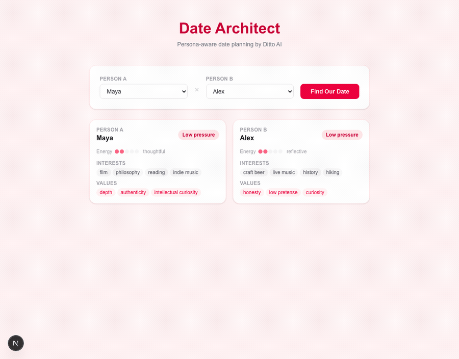

# Date Architect

Pick two people. Get the ideal Penn State date — venue chosen by a scoring engine, personalized date cards written by Claude. Built for Ditto's engineering submission.



---

## How it works

Two-stage pipeline:

1. **Matching engine** (pure Python, no LLM) — scores all 12 venues against the pair on four dimensions: energy fit, shared activity potential, comfort alignment, and vibe match. Each dimension is 0–25; total is 0–100. Deterministic, auditable, runs in milliseconds.

2. **Card generator** (Anthropic SDK) — takes the top-ranked venue and both persona profiles, builds a grounded prompt, and returns two personalized date cards — one per person — each with a compatibility story, venue rationale, specific talking points, and logistics.

A compatibility engine runs in parallel, scoring the two people against each other (energy alignment, interest overlap, values alignment, vibe compatibility) to produce the banner shown at the top of every result.

```
┌──────────────────────────────────────────────────────────┐
│                    Browser (Next.js)                     │
│                                                          │
│   GET /personas ──► Persona A dropdown                   │
│                     Persona B dropdown                   │
│                          │                               │
│                    "Find Our Date"                       │
└──────────────────────────┼───────────────────────────────┘
                           │ POST /generate-date-plan
                           ▼
┌──────────────────────────────────────────────────────────┐
│                    FastAPI backend                        │
│                                                          │
│   ┌─── cache hit? ──────────────────────────────────┐   │
│   │    return precomputed result immediately         │   │
│   └─────────────────────────────────────────────────┘   │
│                          │ (cache miss)                  │
│         ┌────────────────┴─────────────────┐            │
│         ▼                                  ▼            │
│   Matching Engine                  Compatibility Engine  │
│  (venue × pair scorer)             (person × person)     │
│                                                          │
│  energy_match   ──┐               energy_alignment       │
│  shared_activity──┼► RankedVenue  interest_overlap       │
│  comfort_align ───┘  × 12 venues  values_alignment       │
│  vibe_alignment                   vibe_compatibility     │
│         │                                  │            │
│         ▼                                  │            │
│   top venue ──► Anthropic SDK              │            │
│                (card_generator.py)         │            │
│                                            │            │
│  compatibility_story                       │            │
│  venue_rationale                           │            │
│  talking_points                            │            │
│  logistics                                 │            │
└──────────────────────────────────────────────────────────┘
               │ DatePlanResponse
               │  ├─ compatibility (PersonCompatibility)
               │  ├─ venue (RankedVenue)
               │  ├─ runner_up_venues (2 × RankedVenue)
               │  └─ cards (DateCards)
               ▼
        DateCard component (React)
  CompatibilityBanner · Venue card · Persona cards
  Also Considered (runner-up venues)
```

---

## How to run locally

### Prerequisites

- Python 3.11+
- Node.js 18+

No Claude CLI. No API key required — all 30 persona pairs are precomputed and served from cache.

### Backend

```bash
cd backend
python -m venv venv
source venv/bin/activate          # Windows: venv\Scripts\activate
pip install -r requirements.txt
uvicorn app.main:app --reload
# API running at http://localhost:8000
```

### Frontend

```bash
cd frontend
npm install
npm run dev
# UI running at http://localhost:3000
```

Open **http://localhost:3000**, select two personas, and click **Find Our Date**.

---

## Example output — Maya + Alex

**Compatibility: Highly Compatible — 92/100**

| Dimension | Score |
|-----------|-------|
| Energy alignment | 25/25 |
| Interest overlap | 21/25 |
| Values alignment | 21/25 |
| Vibe compatibility | 25/25 |

**Top venue: Elixr Coffee Roasters** · Score: **72/100**

| Dimension | Score |
|-----------|-------|
| Energy match | 25/25 |
| Shared activity | 8/25 |
| Comfort alignment | 23/25 |
| Vibe alignment | 16/25 |

**Also Considered:**
- The Tavern Restaurant — 67/100 · Lost on: comfort fit (18/25)
- Webster's Bookstore Café — 63/100 · Lost on: vibe match (8/25)

**Maya's talking point (Claude-generated):**
> "You mentioned hiking — do you go to find the view at the end, or is it more about
> the time to think on the way up? I always wonder what people are actually chasing out there."

---

## Running tests

```bash
cd backend
source venv/bin/activate
pytest tests/ -v
```

25 tests across 4 files. All pass.

---

## Build notes

The `docs/builder-briefs/` folder has one short doc per phase explaining what was built, why, what was decided, and what was surprising. Start there if you want to understand the reasoning behind the architecture.
